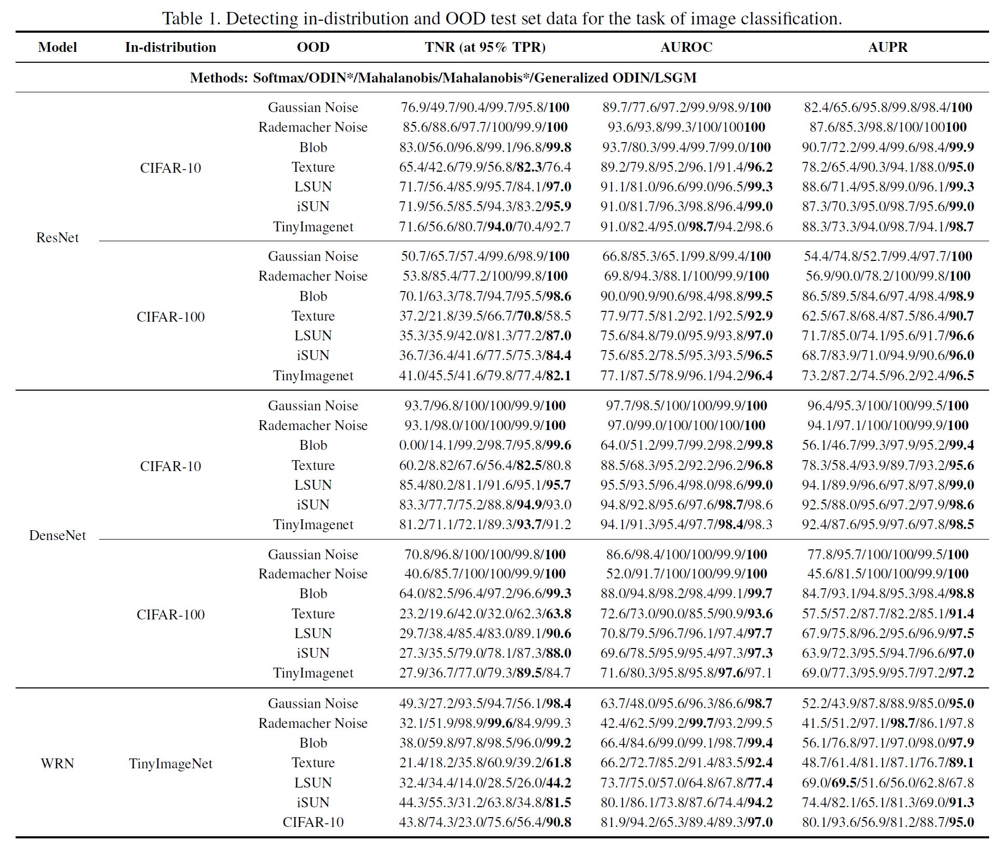

# Out-of-Distribution Detection via Probabilistic Graphical Model of Deep Neural Network Inference

This repository contains the essential code, data, and pre-trained models for the paper *Out-of-Distribution Detection via Probabilistic Graphical Model of Deep Neural Network Inference*.

## Preliminaries

We run our experiments under the Ubuntu 18.04 GPU server, with Intel Xeon CPUs Nvidia 3080 cards. Also we use python anaconda distribution of the version 3.8, and with the power of `conda` the following packages should be easy to install:

* [torch](http://pytorch.org/): Building and evaluating DNN models.
* [scikit-learn](http://scikit-learn.org/stable/): Machine learning algorithms such as GMM.
* [numpy](https://numpy.org/): Matrix manipulation.
* [scipy](https://github.com/scipy/scipy): Statistics algorithms.

## Out-of-Distribution Datasets

Some out-of-distribution datasets we use are from torchvision, such as CIFARs. For the others we provide the download links here for convenient (and for reducing the size of this repository):

* [Tiny-ImageNet](https://www.dropbox.com/s/kp3my3412u5k9rl/Imagenet_resize.tar.gz): The miniature of ImageNet dataset.
* [LSUN](https://www.dropbox.com/s/moqh2wh8696c3yl/LSUN_resize.tar.gz): Large-scale scene images.
* [Textures](https://www.robots.ox.ac.uk/~vgg/data/dtd/): Textural images in the wild.
* [iSUN](https://www.dropbox.com/s/ssz7qxfqae0cca5/iSUN.tar.gz): Gaze traces on SUN dataset images.

## How to use

```bash
$ cd CIFAR # or TinyImageNet, etc.
# model: DenseNet, in-distribution: CIFAR-100, batch_size: 200
$ python test_lsgm.py --architecture densenet --dataset cifar100 --test_bs 200
# model: ResNet, in-distribution: CIFAR-10, load the pre-trained model
$ python test_lsgm.py --architecture resnet --dataset cifar100 --load=./checkpoint
```
If successful, the script will test all OOD datasets with the given configuration.

## Experimental Result

We provide the thorough experimental results as followed, which are the average results of 5 times. We achieve the better performance compared to existing methods, which has been discussed in detail in our paper.


